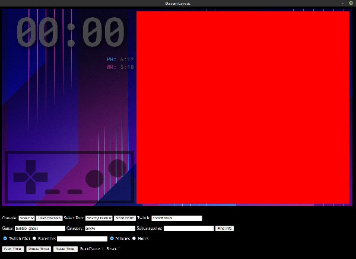

# Stream Layout
A Node.js-based Electron app to use as a stream layout.



Contains an embedded controller input display (NinCID), fading Twitch chat, timer with local hotkeys, personal best and world record queries from speedrun.com, and a racetime.gg race info display.

Customizing the layout requires you to have some knowledge HTML, CSS, and JavaScript.

## Cloning

```
# Clone repository
git clone https://github.com/slashinfty/stream-layout.git && cd stream-layout

# Install
yarn install

# If permissions are not set on chrome-sandbox when attempting to start
sudo chown root node_modules/electron/dist/chrome-sandbox && sudo chmod 4755 node_modules/electron/dist/chrome-sandbox

# If there is an error about bindings and node versions after starting
rm yarn.lock && rm -rf node_modules/serialport node_modules/@serialport
yarn install
./node_modules/.bin/electron-rebuild # For Linux/Mac
# For Windows:
# .\node_modules\.bin\electron-rebuild.cmd 

# Start
yarn start
```

There are commands for building this on your platform of choice. See `scripts` in the [package.json](https://github.com/slashinfty/stream-layout/blob/main/package.json).

## Notes on the Settings

* You have to scan ports upon opening (it looks for a [NintendoSpy](https://github.com/jaburns/NintendoSpy) compatible device)
* Twitch input should be your Twitch name (used for SRC lookup - requires you have your Twitch name registered on SRC)
* SRC lookup is case-insensitive
    * Game input should be the abbreviation on SRC (like `sml2` for `https://www.speednrun.com/sml2`)
    * If there are multiple subcategories, they should be separated by semicolons
* In order for Twitch chat to work, you need the keys located in [_tokens.json](https://github.com/slashinfty/stream-layout/blob/main/public/_tokens.json) (then rename the file as `tokens.json`)
    * Directions for getting the keys are in the [Twitch Chat Client documentation](https://d-fischer.github.io/twitch-chat-client/docs/examples/basic-bot.html)
* Racetime input should be the category and slug (like `sml2/good-atwodfive-8440` for `https://racetime.gg/sml2/good-atwodfive-8440`)
* Timer hotkeys can be changed in [timer.js](https://github.com/slashinfty/stream-layout/blob/main/public/timer.js#L7-L24)
    * The on-screen reminder can then be updated in [index.html](https://github.com/slashinfty/stream-layout/blob/main/public/index.html#L70)